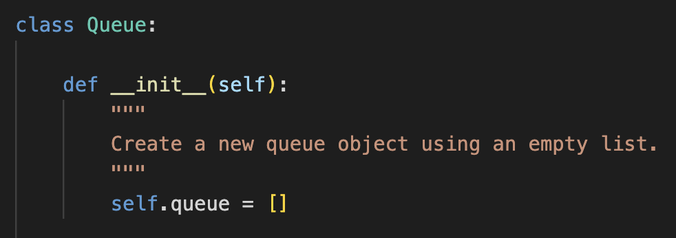

<nav class="ds-nav">
  <a class="active" href="/python_dataStructures/">Queues</a>
  <a href="/python_dataStructures/sets.html">Sets</a>
  <a href="/python_dataStructures/linkedLists.html">Linked Lists</a>
  <a href="/python_dataStructures/trees.html">Trees</a>
</nav>

# Queues


A queue is characterized by its **First In, First Out (FIFO) behavior**. This means that data
is always added to the back of a queue, and it can only be removed once it has finally
advanced to the very front of the queue.

**Thus, the order that data leaves a queue will be the same order in which it entered the queue.**

Compared to other data structures, a queue's behavior is relatively simple and easy to
understand from a real-world perspective. When data enters a queue, it is just taking its
place to wait at the back of a line like its human counterparts do all the time. The most
obvious difference is that data is perfectly patient when waiting its turn (which is a far cry
from what transpires at the DMV), so data never tries to "cut" when waiting its turn to exit
the queue, nor does it try to leave the queue early.

&nbsp;

## Queue Usage in Technology

Technology utilizes queues extensively. Queues provide structure and order when automated tasks
must be carried out, and they provide a way for resources to be shared without overwhelming
and crashing a system.

### Printer Queues

Way back when printers were prohibitively expensive, it was common practice for many users
to all share the same printer. The printer would end up receiving tons of print job requests,
so it would organize these requests into a queue to methodically print every request.


Personal printers may be much easier to purchase nowadays, but it still accomplishes all its
printing tasks by starting with the request that was received first, then the second request,
followed by the third request, and so on.

**Additional Examples of Queues Include:**

- **CPU scheduling**, in which the operating system determines which process will be
  run by the CPU based on its place in a queue. Some higher priority processes do get to
  skip over others, but "first come, first served" queues are typically used during times
  when mostly routine maintenance processes are in the queue.
- **Company call centers**, which determine which customer gets to speak to a representative
  next based on how long they've been in the waiting queue.
- **Websites**, which can't handle all HTTP requests at once. It serves each request using
  queues, which helps ensure that website response times aren't sluggish.

&nbsp;

## Queue Implementation

Queues can be implemented in many different coding languages in addition to Python, including
C, C++, and Java. Even though the actual implementation details vary based on which coding language is being used, the set of operations associated with queues will remain the same.

In Python, queues are **implemented using lists**:



Lists in Python are **dynamic arrays**.

This means a queue's data will be stored in memory addresses that are contiguous to each other. This will play a large role in determining the
performance level of each operation.

&nbsp;

## Queue Operations

&nbsp;
Operation | Description | Example<br>_(in Python)_ | Performance
-------------- | ------------------- | --------------- | --------------
enqueue(value) | "value" is added to the back of the queue. | a_queue.append(value) | O(1) - Appending to the back of the queue always occurs in constant time.
dequeue() | Removes and returns the value at the front of the queue. | value = a_queue[0]<br>del a_queue[0]<br>_or_<br>value = a_queue.pop(0) | O(n) - Removing the value at index 0 results in a shift in which all elements move up the queue by one index value. Every element must be iterated through to perform this shift.
size() | Returns the number of elements in the queue. | length = len(a_queue) | O(1) - Queues keep track of its<br>size internally. No iterations are necessary when len() is called.
is_empty() | Checks if the queue is empty. | if len(a_queue) == 0: | O(1) - Queues keep track of its<br>size internally, so no loops are necessary.

```python
"""
Implements a simple queue class using the 4
aforementioned queue operations (enqueue,
dequeue, size, is_empty), and print_queue.
"""
class Queue:

    def __init__(self):
        """
        Create a new queue object that's empty (for now).
        """
        self.queue = []

    def size(self):
        """
        Returns the size of the queue object. Retrieving
        the size has an O(1) performance level.
        """
        return len(self.queue)


    def is_empty(self):
        """
        Returns True when the queue is empty of any values.
        This operation has an O(1) performance level.
        """
        if len(self.queue) > 0:
            return False

        return True

    def enqueue(self, element_value):
        """
        Adds the value of a new queue element to the very
        back of the queue. Enqueue has an O(1) performance
        level.
        """
        self.queue.append(element_value)

    def dequeue(self):
        """
        Per its "First In, First Out" behavior, the
        element value that's at the very front of the queue
        gets removed by dequeue. The queue stores its values
        in a dynamic array, which gives it O(n) performance.
        """

        # Check if the queue is empty
        if self.is_empty():
            print("The queue is empty.")
            return None

        # Remove the element from the queue,
        # and return its value
        value = self.queue.pop(0)
        return value

    def print_queue(self):
        """
        Display all the element values in the queue.
        """
        # Check if the queue is empty
        if self.is_empty():
            print("The queue is empty.")
        else:
            # Find the final index value so the last element
            # can be printed without a comma after it.
            size = self.size()
            maxIndex = size - 1

            # Print each value found in the queue
            for element in self.queue:
                if element != self.queue[maxIndex]:
                    print(element, end=", ")

                # Print last value
                else:
                    print(element)


########################################
# Check that the queue operations
# work as expected.
########################################

# Create a queue.
my_queue = Queue()

# Add 5 values to the queue using enqueue.
my_queue.enqueue("first")
my_queue.enqueue("second")
my_queue.enqueue("third")
my_queue.enqueue("fourth")
my_queue.enqueue("fifth")

# Prints "first, second, third, fourth, fifth"
# since values are added to the back of the queue.
my_queue.print_queue()

# Remove 2 values from the queue using dequeue.
my_queue.dequeue()
my_queue.dequeue()

# Prints "third, fourth, fifth"
# since values are removed from the front.
my_queue.print_queue()

# Add "first" and "second" to the back of the
# queue again.
my_queue.enqueue("first")
my_queue.enqueue("second")

# Prints "third, fourth, fifth, first, second"
my_queue.print_queue()

```

Note that **deque** (pronounced as _"deck"_) provides a **more efficient implementation of the dequeue operation.** It is a more versatile object from Python's collections module that can add and remove elements from the back _and_ the front using linked lists as its basis instead of dynamic arrays.

Deque stands for "double-ended queue" because it adds and removes elements from both ends in constant O(1) time. By using linked lists, operations like dequeue become more efficient because there is no shifting of elements located in contiguous memory addresses.

&nbsp;

## Example: Movie Ticket Queue

Imagine a bustling movie theater with a long line of excited moviegoers eagerly waiting to purchase their tickets. This scenario perfectly embodies the "First In, First Out" principle that defines queues.

Although, the ticket-purchasing dynamics aren't always as straightforward as one might assume. Oftentimes people attending the movies as a group will stand in line together, then a single member of the group purchases tickets on behalf of everyone.

This example demonstrates how queues, despite their straightforward nature, are still able to adapt to this slight twist when determining whose up next to buy tickets without any additional effort.

The .py version of this example can be found [here](python/queue-example.py)

```python
class Queue:
    """
    This is the same queue class that's shown
    previously. The only difference is that a
    few things were renamed to better reflect
    the scenario and additional methods were
    added to increase functionality.
    """

    def __init__(self):
        """
        Create an empty queue called line.
        """
        self.line = []

    def size(self):
        """
        Returns the size of the customer line.
        """
        return len(self.line)

    def is_empty(self):
        """
        Returns True when the customer line is empty.
        """
        if len(self.line) > 0:
            return False

        return True

    def enqueue(self, person):
        """
        Adds a new person to the very back of the line.
        """
        self.line.append(person)

    def dequeue(self):
        """
        Removes a person from the front of the line.
        """
        # Check if the line is empty
        if self.is_empty():
            print("The line is empty.")
            return None

        # Remove the person at the front of
        # the line.
        person = self.line[0]
        del self.line[0]
        return person

    def upNext(self):
        """
        Displays whose turn it is to buy tickets.
        """
        print(f"Now it is {self.line[0]}'s turn to buy tickets.\n")

    def show_line(self):
        """
        Displays all the people in the ticket line.
        """
        # Check if the line is empty
        if self.is_empty():
            print("The line is empty.")
        else:
            # Represents the front of the line.
            position = 1

            # Display the order of people waiting
            # in line.
            print("The current line order: ")
            for person in self.line:
                print(f"{position}. {person}")
                position += 1

            print("\n")

    def display_line_stats(self):
        """
        Displays who gets to purchase tickets next, along with the
        current order of people in line.
        """
        # Check if the line is empty
        if self.is_empty():
            print("The line is now empty.")
            return

        self.upNext()
        self.show_line()

    def buyTickets(self, num_tickets):
        """
        Updates the line based on how many tickets were
        purchased by the person at the front of the line.
        """
        # Check if the line is empty.
        if self.is_empty():
            print("The line is currently empty.")
            return

        # Display who is purchasing tickets, along
        # with the number of tickets being purchased.
        print(f"{self.line[0]} just bought {num_tickets} tickets.")

        # The amount of people who leave the line is
        # based on the number of purchased tickets.
        for customers in range(num_tickets):
            self.dequeue()

        # Show new line stats following ticket purchase
        self.display_line_stats()


########################################
# Example: Movie ticket queue to
# demonstrate how queues can determine
# the next person in line to buy tickets
# with efficiency
########################################

# Create a queue of moviegoers waiting in line to buy tickets.
ticketLine = Queue()

# Add people to the line
ticketLine.enqueue("James")
ticketLine.enqueue("Rebecca")
ticketLine.enqueue("Dallin")
ticketLine.enqueue("Adelyn")
ticketLine.enqueue("Parker")
ticketLine.enqueue("Brynley")
ticketLine.enqueue("Carson")
ticketLine.enqueue("Janette")

# Display the current line.
ticketLine.show_line()
"""
The current line order:
1. James
2. Rebecca
3. Dallin
4. Adelyn
5. Parker
6. Brynley
7. Carson
8. Janette
"""

# Update line based on the amount of tickets bought.
ticketLine.buyTickets(5)
"""
James just bought 5 tickets.
Now it is Brynley's turn to buy tickets.

The current line order:
1. Brynley
2. Carson
3. Janette
"""

# Two more people join the line.
ticketLine.enqueue("Loren")
ticketLine.enqueue("Noelle")

# Display updated line.
ticketLine.show_line()
"""
The current line order:
1. Brynley
2. Carson
3. Janette
4. Loren
5. Noelle
"""

# Two final ticket purchases are made.
# The line updates after each purchase accordingly.
ticketLine.buyTickets(3)
"""
Brynley just bought 3 tickets.
Now it is Loren's turn to buy tickets.

The current line order:
1. Loren
2. Noelle
"""

ticketLine.buyTickets(2)
"""
Loren just bought 2 tickets.
The line is now empty.
"""
```

&nbsp;

## Digging Deeper: Queues vs. Stacks

One of the interesting things about queues is that it has a sibling data structure, so to
speak, called stacks. Stacks, like queues, are implemented in Python using lists.

While queues are the main focus of this lesson, it is worth bringing up stacks because
understanding their similarities and differences comes in handy when trying to decide
between using a queue or a stack in a program.

### Similarities

- As dynamic arrays, queues and stacks are both stored in contiguous memory addresses.
- Their elements can be accessed easily.
- Queues and stacks have no fixed sizes. They can grow in size as more elements are added.
- A user may have to create a larger queue or stack if they run out of memory,
  but this does not occur frequently.
- Neither one inserts or removes data from somewhere in between the first and last indices.

### Differences

- Queues use First In, First Out (FIFO) behavior, whereas stacks use Last In, First Out (LIFO) behavior.
- With LIFO, data gets added _and_ removed from the end of the list. The data element that was most recently
  added to a stack will be the first to leave it.
- Think of stacks like adding and removing ceramic plates from a whole stack of breakable plates. In order
  to avoid a very shattering case of plate extinction, plates are stored by stacking each new plate top of
  each other, and they are retrieved by selecting whichever plate is currently on the very top of the stack.

### Can data be added or removed from somewhere in the middle of Queues and/or Stacks?

Technically speaking, additional code can be written to make these things possible. However,  
only being able to add data in the back and remove data from the front are characteristics that
define a queue. Likewise, only being able to add and remove data from the back is what defines
a stack. So, once a queue or a stack class breaks out of their defined behaviors, then they aren't
necessarily considered queues or stacks any more.

&nbsp;

## Final Problem to Solve: Library Book Waitlist Queue

To practice using a queue in a program, try designing a waitlist queue for a library
system. This program is just a simplified version, so it doesn't need to take all
aspects of an actual library waitlist into consideration.

### Specifications

**Design a class called Waitlist_Queue:**

- The only attribute that a Waitlist_Queue object requires is a list called "queue".
- The queue attribute will store library card barcodes.
  - Library systems don't place people on waitlists using their names. They need a more unique
    identifier, which is why the barcode from a person's library card is used instead.
- Only implement the operations of a queue as methods for this class. No "bonus" print method is necessary
  (that will be included in the Book class).

**Design another class called Book:**

- A Book object will have a title, an inventory number, and a Waitlist_Queue object called "waitlist"
  as its attributes.
- Implement the is_available() method to check if a book is currently available to check out.
- Implement the add_waitlist() method to add the barcode of a person's library card to a book's waitlist
  if it is unavailable.
- Implement the check_out() method, which either "checks out" a book by adjusting its inventory size,
  or it places someone (using their library card barcode) onto the book's waiting list when they attempt
  to check out a currently unavailable book.
- Implement the return_book() method so a book gets added back into the inventory if its waitlist is
  empty, or it "gives" the book to the next person on the waitlist.
- Implement the print_waitlist() method to show all the card barcodes that are stored in a book's waitlist.
  Rank each barcode according to its position in the waitlist (1 would be at the front).
- Implement the display_status() method to provide updates on a book's status.
  - Is the book available to be checked out?
  - If it isn't available, then is there currently a waitlist?
  - If there is a waitlist, then what is its size? How is the waitlist currently ranked?

Trying to solve this problem from scratch is encouraged. However, if additional
guidance if needed, try solving [this version of the problem instead.](python/queue-solution.py)

The full solution of this problem can be found [here](python/queue-solution.py)

### Once your program is complete, test the accuracy of your code by running these tests:

```python
# Create 4 waitlists using the Waitlist_Queue class and 4
# book collections using the Book class. Every book collection
# receives one waitlist as an attribute.

waitlist1 = Waitlist_Queue()
book1 = Book("Structure and Interpretation of Computer Programs", 2, waitlist1)

waitlist2 = Waitlist_Queue()
book2 = Book("Programming Pearls", 1, waitlist2)

waitlist3 = Waitlist_Queue()
book3 = Book("The Pragmatic Programmer: Your Journey to Mastery", 2, waitlist3)

waitlist4 = Waitlist_Queue()
book4 = Book("Code Simplicity: the Fundamentals of Software", 3, waitlist4)


print("\n=========== TEST 1 ===========")
# There are 2 copies of book1. Check that the waitlist
# grows once the book's demand is greater than
# its supply.

book1.check_out(1111)
book1.check_out(2222)
book1.check_out(3333)
book1.check_out(4444)

print("*** 4 attempts were made to check out book1's 2 copies ***")
book1.display_status()
"""
'Structure and Interpretation of Computer Programs' is currently unavailable to check out. There are 2 people on the waitlist.

Here is the current waitlist for 'Structure and Interpretation of Computer Programs':

    1. barcode #3333
    2. barcode #4444
"""


print("\n=========== TEST 2 ===========")
# There is only 1 copy of book2. Confirm that the
# status of book2 changes once it is checked out
# to reflect that it is unavailable for check-out.
book2.check_out(1001)

print("*** The only copy of book2 was checked out ***")
book2.display_status()
"""
'Programming Pearls' is currently unavailable to check out, but its waitlist is empty.
"""

# Confirm that book2's status switches to being
# available once it is returned.
book2.return_book()

print("\n*** The only copy of book2 was returned ***")
book2.display_status()
"""
'Programming Pearls' is currently available to check out.
"""


print("\n=========== TEST 3 ===========")
# Let's check that the waitlist queue behaves as
# expected when more than one book becomes available.

# There are 2 copies of book3.
book3.check_out(1122)
book3.check_out(3344)
book3.check_out(5566)
book3.check_out(7788)
book3.check_out(9911)

print("\n*** 5 attempts were made to check out the 2 copies of book3 ***")
book3.display_status()
"""
'The Pragmatic Programmer: Your Journey to Mastery' is currently unavailable to check out. There are 3 people on the waitlist.

Here is the current waitlist for 'The Pragmatic Programmer: Your Journey to Mastery':

    1. barcode #5566
    2. barcode #7788
    3. barcode #9911
"""

# Confirm that, once 2 copies get returned, they are
# checked out to the 1st and 2nd waitlisters.
book3.return_book()
book3.return_book()

print("\n*** The 2 copies of book3 were returned ***")
book3.display_status()
"""
'The Pragmatic Programmer: Your Journey to Mastery' is currently unavailable to check out. There are 1 people on the waitlist.

Here is the current waitlist for 'The Pragmatic Programmer: Your Journey to Mastery':

    1. barcode #9911
"""


print("\n=========== TEST 4 ===========")
# Let's exercise the waitlist queue a little more
# just to further confirm that it works as expected.

# There are 3 copies of book4.
book4.check_out(1110)
book4.check_out(2221)
book4.check_out(3332)
book4.check_out(4443)


print("\n*** 4 attempts were made to check out the 3 copies of book4 ***")
book4.display_status()
"""
'Code Simplicity: the Fundamentals of Software' is currently unavailable to check out. There are 1 people on the waitlist.

Here is the current waitlist for 'Code Simplicity: the Fundamentals of Software':

    1. barcode #4443
"""

# Return all 3 copies (one should automatically go to the waitlister).
book4.return_book()
book4.return_book()
book4.return_book()


print("\n*** All 3 copies of book4 were returned (although only 2 should end back up in inventory) ***")
book4.display_status()
"""
'Code Simplicity: the Fundamentals of Software' is currently available to check out.
"""

book4.check_out(5554)
book4.check_out(6665)

# This result confirms that 2, and not 3, copies got added to inventory after
# the previous step.
print("\n*** 2 copies got checked out again. ***")
book4.display_status()
"""
'Code Simplicity: the Fundamentals of Software' is currently unavailable to check out, but its waitlist is empty.
"""
```

## [Click Here](queue_attributions.md) to view all attributions for this tutorial.
