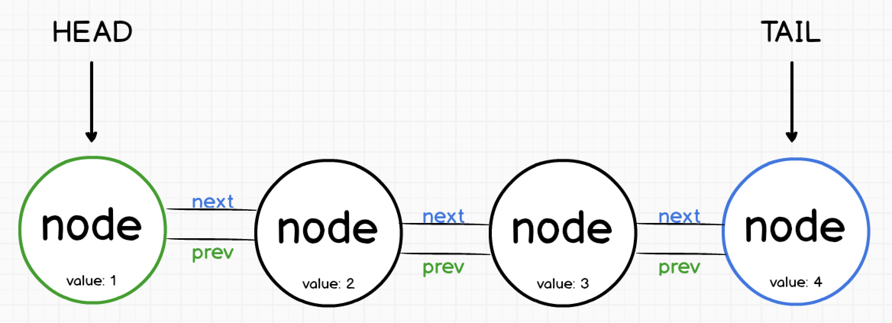
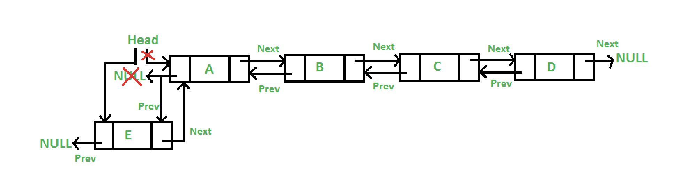
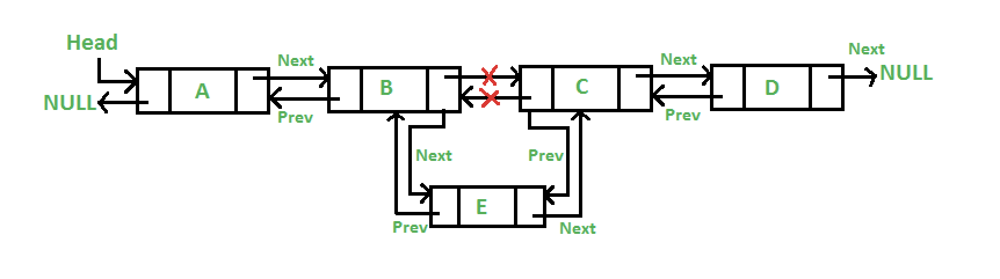
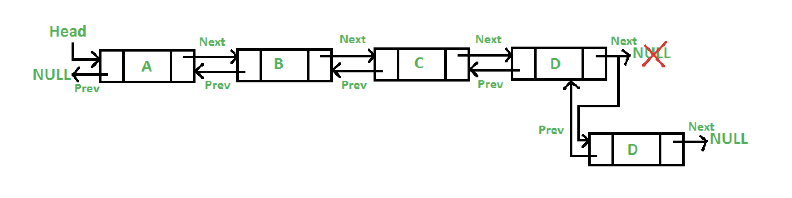

# Linked List Tutorial Attributions

## Class Materials:

[Lesson 07: Linked Lists](https://byui-cse.github.io/cse212-course/lesson07/07-prepare.html)

&nbsp;

## Online Articles:

[Linked Lists in Python: An Introduction](https://realpython.com/linked-lists-python/)

[Implementing Your Own Linked List](https://realpython.com/linked-lists-python/#implementing-your-own-linked-list)

&nbsp;

## Images:

[1. A Linked List, and a Node](https://siddharthschandran44.medium.com/linked-list-reordering-9613dd4d7a1f)

[2. A Doubly-Linked List](https://www.codecademy.com/learn/linear-data-structures-python/modules/linked-lists-python/cheatsheet)

[3. Insertion at the Head of a Doubly-Linked List](https://www.geeksforgeeks.org/introduction-and-insertion-in-a-doubly-linked-list/)

[4. Insertion in the Middle of a Doubly-Linked List](https://www.geeksforgeeks.org/introduction-and-insertion-in-a-doubly-linked-list/)

[5. Insertion at the Tail of a Doubly-Linked List](https://www.geeksforgeeks.org/introduction-and-insertion-in-a-doubly-linked-list/)

