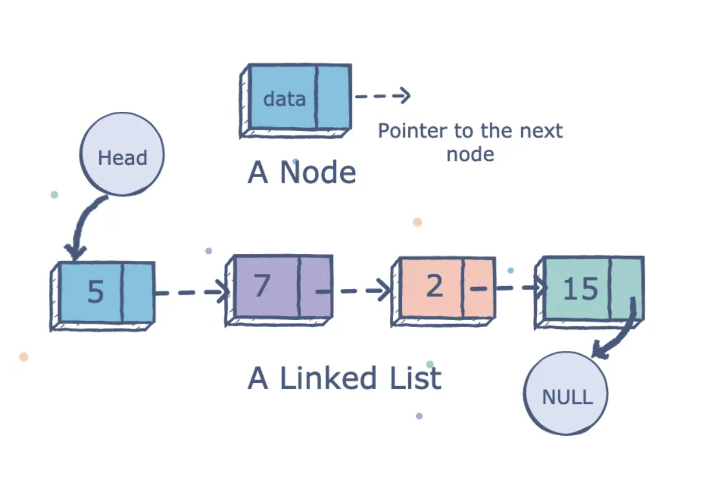

# Linked Lists
Data structures such as queues and stacks 
**The advantages over dynamic array-based data structures include:**
* Adding and removing elements only has an effect on neighboring elements.
* Linked lists never run out of space. Every time it needs a memory block, it uses pointers to link to one.

## Linked List Performance vs. Dynamic Arrays

### Adding / Removing Elements
Adding or removing elements from the tail of a dynamic array always takes a constant O(1) time. However, the time complexity of these actions increases as the element being acted upon moves closer to the head of the array. Dynamic arrays rely on storing its elements in contiguous memory, so its elements must shift in order to add space for a new element or fill the space vacated by a former element. If an element is added or removed from the head, the performance becomes O(n) since all elements must shift to adjust.

Linked lists **are just as efficient as stacks** because stacks always add elements to *and* remove elements from the tail.

Linked lists **perform better than queues when removing elements,** since queues only remove elements from the head, causing shifts for all the remaining elements. Linked lists and queues are equally efficient when adding elements because queues add to the tail.

Note that the performance disadvantage of removing elements from the head of a queue can be solved when a **deque** is implemented instead of a queue. It is a more versatile object from Python's collections module that can add and remove elements from its tail *and* its head using linked lists as its basis instead of dynamic arrays.

Deque stands for "double-ended queue" because it adds and removes elements from both ends in constant O(1) time. By using linked lists, there is never any shifting of elements located in contiguous memory addresses.

### Retrieving Elements
When searching for an element without knowing its index, then both linked lists and dynamic arrays must traverse through every element in O(n) time until the element is found (if it is indeed found).

However, dynamic arrays **outperform linked lists when the index is known.** In this case, dynamic arrays can retrieve the desired element in O(1) time because its elements are stored in contiguous memory blocks, so there is no need to traverse through them. Linked lists, on the other hand, must still traverse through every element in O(n) time because its elements are stored in scattered memory addresses. There is no possible way to locate an element unless the linked list's nodes are traversed one by one. 

## Structure of a Linked List
Linked lists do not store its elements side-by-side in contiguous memory blocks like dynamic arrays for easy access. It stores its elements randomly in memory, and it makes these elements accessible by creating a link (using a pointer) on each element that contains the memory location of the next element in the linked list.

Linked lists do not store its elements side-by-side in contiguous memory blocks like dynamic arrays for easy access. It stores its elements randomly in memory, so links (using pointers) are created which contain the memory location of the next element in the linked list. This makes it possible for elements to be traversed in a linked list without order to make these elements accessible links are created (using a pointer) on each element that contains the memory address of the next element in the linked list.

The component of the linked list that stores an element and the link is referred to as a **node.** The **head** is the first node in the linked list, and the **tail** is the last node in the linked list.

A **doubly-linked list** is created when each node stores a link to the next element and a link to the previous element.

A doubly-linked list can be traversed by starting at the head and following the next node links forward, or it can start at the tail and follow the previous node links backwards.

## Implementing a Doubly-Linked List

### Inserting at the Head

If the list is **currently empty**, then 

### Inserting at the Tail

### Inserting in the Middle

### Element Access

### Element Removal

## Linked List Operations

## Deque