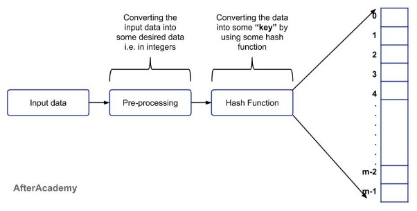

# Sets
The set data structure is renowned for its highly efficient membership determination. Sets can ascertain 
whether they contain a specific element without needing to iterate through its data. What makes sets even
more remarkable is that they do not attempt to sort any incoming data at face value. Instead, a set manages 
to keep track of all its elements using a technique called hashing.

&nbsp;
## Hashing
Hashing is a powerful process that has a lot of different applications in technology today, including the 
fields of cybersecurity and database management. While its actual implementation details may differ based 
on the application, hashing always provides a means by which information can be broken down into smaller 
bits of information that's completely unique and easily retrievable.

Hashing comes into play when elements are stored in or retrieved from a **hash table.**

### Hash Tables
A hash table is a kind of data structure that stores each element from a set as a unique key-value pair. 
The element's index in the table is computed using the hashing process. 

In this process, an element's key is fed into a **hash function** that returns **hash code**. Notably, the 
hash code is always an integer, even if the original key is not. This hash code is then used to compute the 
element's index value within the table. 

Hashing makes it possible to instantaneouly locate an element's index, so elements can be added, removed, 
and retrieved in constant O(1) time. 



### A Simple Example

### Collisions

### Hashable Elements
An element is hashable if Python's hash() function can be called on it.
Hashing can only be used on elements that are **immutable**, which cannot be modified after being defined. 
This is because any modification to an element will change its hash code, and thus its position in the hash 
table. This would inevitably lead to element collisions, and any attempt at conflict resolution would be 
null and void as other collisions are bound to occur as more changes are made.

**Immutable (and thus hashable) elements include:**
* integers
* strings
* tuples
* booleans

A set can contain a variety of data types, as long as they are hashable.

**Non-hashable elements include:**
* lists
* dictionaries

&nbsp;
## Set Implementation
A populated set can be created using **curly braces:**

```python
    colors = {'red', 'green', 'blue'}
```

Or, a set can be created using Python's **built-in set() function:** 

```python
    sports = set('soccer', 'volleyball', 'football')
```

The set() function **must be used when creating an empty set**. A
set of empty curly brackets will create a dict instead:
```python
    emptyDict = {}
    emptySet = set()

    print(type(emptyDict)) # <class 'dict'>
    print(type(emptySet))  # <class 'set'>
```

Keep in mind that these two methods are **not one in the same:**
* Curly braces accept objects as arguments, so the input is left as is.
    ```python
    new_set = {<obj>, <obj>, ..., <obj>}
    ```
* set() accepts iterables as arguments, so it will break up the input, 
thereby creating a list of elements to put in the set.
    ```python
    new_set = set(<iter>)
    ```

Thus, identical arguments will produce different results based
on the implementation method used:
```python
    obj_argument = {'abc'}     # Creates a set using 'abc' as an object
    iter_argument = set('abc') # Creates a set using 'abc' as an iterable

    print(obj_argument)   # {'abc'}
    print(iter_argument)  # {'a', 'b', 'c'}
```

&nbsp;
## Characteristics 
* Elements cannot be accessed using indexes.
* All elements must be unique.
* Elements are not stored in any particular order.
* Sets can be modified, but only immutable data types may be stored in a set.

### Accessing Elements

### Unique Elements
All elements in a set must be unique because the hash code created
by two duplicate keys will also be the same. Thus, only the first
element to be hashed will be placed in the hash table. The second element
will not be added when it's intended index location is already occupied
with an element that shares the same hash code.

```python
    # Declares a set with 2 copies of 'NV'
    set_duplicateObjects = {'NV', 'AK', 'CO', 'TN', 'NV', 'NY'}    

    # Declares a set with 3 copies of 'z'  
    set_duplicateIterables = set('zzyzx') 

    # No duplicates included
    print(set_duplicateObjects)    # {'TN', 'AK', 'NY', 'CO', 'NV'}
    print(set_duplicateIterables)  # {'y', 'x', 'z'}
```
Note that both sets are not alphabetically ordered because
the value of each element does not affect its placement. The
hash code corresponding to each element will determine its
placement. In addition, the order of elements usually changes
each time the program is run. Certain factors like an element's 
location in memory (which also varies each time the program is
run) will influence the hash code.

&nbsp;
## Set Operations 
  operation   |     description     |     example     |  performance
------------- | ------------------- | --------------- | --------------
add(value)    | "value" is added to<br>the set. | a_set.add(value) | O(1) - Hashing enables instantaneous lookup<br>(assuming any conflicts are resolved).
remove(value) | "value" is removed<br>from the set. | a_set.remove(value) | O(1) - Hashing enables instantaneous lookup<br>(assuming any conflicts are resolved).
member(value) | Determines if "value"<br>is in the set. | if value **in** a_set | O(1) - Hashing enables instantaneous lookup<br>(assuming any conflicts are resolved).
size()        | Returns the number<br>of set elements. | length = len(a_set) | O(1) - Sets keep track of its<br>size internally, so no loops are necessary.

```python
# Creates a set using string objects as arguments
fruits = {'apple', 'banana', 'orange', 'grape', 'kiwi'}

# Initial set: {'banana', 'grape', 'orange', 'apple', 'kiwi'}
print("Initial set:", fruits) 

# Adds an element to the set
fruits.add('pear')

# After adding 'pear': {'banana', 'grape', 'orange', 'apple', 'pear', 'kiwi'}
print("After adding 'pear':", fruits)

# Removes an element from the set
fruits.remove('banana')

# After removing 'banana': {'grape', 'orange', 'apple', 'pear', 'kiwi'}
print("After removing 'banana':", fruits)

# Check 'kiwi' & 'banana' for membership
print("'kiwi' in fruits:", 'kiwi' in fruits)       # 'kiwi' in fruits: True
print("'banana' in fruits:", 'banana' in fruits)   # 'banana' in fruits: False
```
Sets, as previously mentioned, can only contain elements with immutable data types. However, operations 
such as add and remove exemplify that **sets themselves can be modified.**

**Other set modification operations include:**
* discard
* pop
* clear
* update
* intersection_update
* difference_update

&nbsp;
## Set Mathematical Operations 
  operation   |     description     |     example     |  performance
------------- | ------------------- | --------------- | --------------
union         | Combines two or<br>more sets into one set. | set1.union(set2)<br>*or*<br>set1 \| set2 | O(n) - Every element in the<br>smaller set must be checked to<br>ensure there are no duplicate values in the new set.
intersection  | Returns a set that<br>only contains elements shared<br>among two or more sets. | set1.intersection(set2)<br>*or*<br>set1 & set2 | O(n) - Every element in the<br>smaller set must be checked to<br>ensure that only the shared elements are placed in the new set.      
difference    | Returns a set that<br>only contains the elements<br>that are in the first set, but not in the second set. | set1.difference(set2)<br>*or*<br>set1 - set2 | O(n) - Every element in the set being called on (i.e. set1) must be compared against the elements in the sets used as arguments (i.e. set2 ).

```python
# Create a set containing sports
sports = {'soccer', 'basketball', 'tennis', 'swimming', 'cycling'}

# Create a set containing sports played as a team
team_sports = {'soccer', 'basketball', 'volleyball', 'hockey'}

# Combine all unique elements from sports and
# team_sports into one set
all_sports = sports.union(team_sports)

# Union of sets: {'volleyball', 'hockey', 'soccer', 'cycling', 'tennis', 'swimming', 'basketball'}
print("Union of sets:", all_sports)

# Combine all shared elements from sports and
# team_sports into one set
shared_sports = sports.intersection(team_sports)

# Intersection of sets: {'soccer', 'basketball'}
print("Intersection of sets:", shared_sports)

# Create a set with elements that are unique 
# to the sports set when compared with team_sports
non_team_sports = sports.difference(team_sports)

# Difference of sets: {'cycling', 'swimming', 'tennis'}
print("Difference of sets:", non_team_sports)

```

**Other set mathematical operations include:**
* symmetric_difference
* isdisjoint
* issubset
* issuperset

&nbsp;
## Final Problem to Solve: Retrieve Basic Information about Students and their High School Classes
One of the more unique aspects of this problem is that simpler data sets, are more straightforward when implementing methods. The set of students only contains objects from the Student class, which comes with its own set (no pun intended) of challenges.

**Things to note**
1. Determining membership when the set's key is a custom object
2. Python's built-in hash function must be used.

## [Click Here](set_attributions.md) to view all attributions for this tutorial.