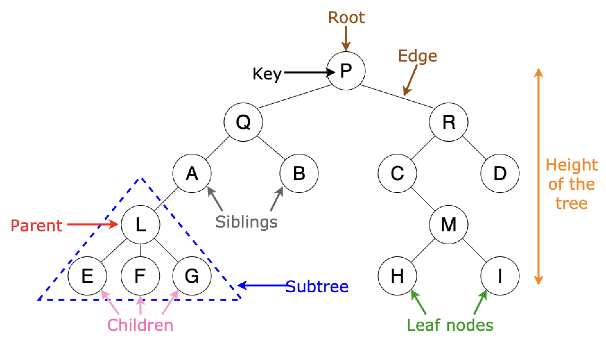

# Trees
A tree is like a linked list in the sense that both data structures are made up of nodes that reside in memory randomly. But trees digress in that they can link a single node to multiple other nodes. This makes it possible for trees to move in other directions, beyond the single or doubly-linked straight lines that linked lists are limited to following at all times.

## bisect module

&nbsp;
## Tree Terms
The very first node of a tree is known as the **root** node, and there is only one root node per tree. A **parent** node refers to any node in the tree that connects to lower nodes, while these lower nodes are called **child** nodes. Two child nodes of the same parent node are considered **sibling** nodes. Any node without a child node is a **leaf** node. 

One tree also contains **subtrees**. A subtree consists of one parent node, and all its child nodes. A subtree can span more than two levels, and the total number of levels in the whole tree is considered its **height**.

&nbsp;
## Binary Search Tree