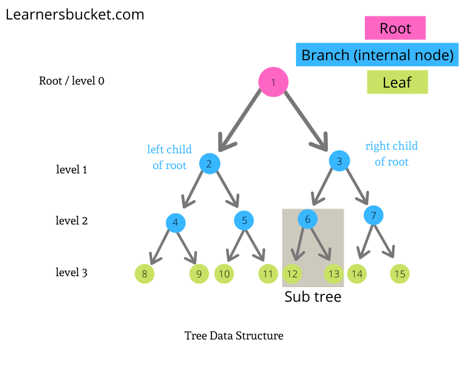

# Trees
A tree is like a linked list in the sense that both data structures are made up of nodes that reside in memory randomly. But trees digress in that they can link a single node to multiple other nodes. This makes it possible for trees to move in other directions, beyond the single or doubly-linked straight lines that linked lists are limited to following at all times.

## bisect module

&nbsp;
## The Binary Search
Searching for data in a linked list is not achieved in constant time. Nodes are added to the linked list without any attempt to sort the incoming data, and as a result, the searches are performed in O(n) time. This may not be an issue if there are only 10 nodes in the linked list, but this process is akin to taking one page from a stack of unsorted pages and flipping through them one-by-one until the right page is found. With large data sets, this process is extremely inefficient.

But, what if you were able to split the amount of pages you needed to search in half, so you only have to deal with 1/2 of the original stack, and then you split *that* reduced stack in half so it becomes only 1/4 of the original size, and then you let the process of splitting the search stack in half continue until it is reduced to just a few pages? You will undoubtedly reach that point by taking just a small fraction of the number of steps you would have taken if the stack maintained its original size.

As a simple demonstration, let's apply this binary search process to find page 325 within a sorted stack of pages numbered 1 - 800:

**Step 1:** Split all 800 pages of the stack in half. Is 325 greater than, less than, or equal to 400? Knowing that it is less means that the upper half of the stack, pages 400 - 800, can be discarded without any risk of discarding page 325 as well.

**Step 2:** Split the first 400 pages of the stack in half. Is 325 greater than, less than, or equal to 200? It is greater, so this time the lower half of the search stack, pages 1 - 200, can be discarded.

**Step 3:** Split pages 200 to 400 of the stack in half. Is 325 greater than, less than, or equal to 300? It is greater, so the lower half of the search stack, pages 200 to 300, can be discarded.

**Step 4:** Split pages 300 to 400 of the stack in half. Is 325 greater than, less than, or equal to 350? It is less, so the upper half of the search stack, pages 350 to 400, can be discarded.

**Step 5:** Split pages 300 to 350 of the stack in half. Is 325 greater than, less than, or equal to 325? It is equal, so the search is over!

In this instance, page 325 was found in 5 steps, rather than 325 steps if each sorted page was checked beginning at page 1. And if the pages were unsorted, then it easily could have taken over 325 steps.

&nbsp;
## The Binary Search Tree 
The very first node of a binary search tree is known as the **root** node, and there is only one root node per tree. A **parent** node refers to any node in the tree that connects to lower nodes, while these lower nodes are called **child** nodes. Two child nodes of the same parent node are considered **sibling** nodes. Any node without a child node is a **leaf** node. 

One binary search tree also contains **subtrees**. A subtree consists of one parent node, and all its child nodes. A subtree can span more than two levels, and the total number of levels in the whole tree is considered its **height**.

### Node Placement
A binary sort tree determines where the node of a new element will be placed by first comparing the value of the new element to the value found in the root node. If it is less than the node, then it will be placed in the left subtree. If it is greater than the node, then it will be placed in the right subtree. If the tree allows duplicate values, then any equivalent values can be placed in either the left or the right subtree according to the specifics set forth in the binary sorting algorithm. 

If the root node already contains a child node in the subtree position intended for the new node, then those two nodes are compared using the same logic rules. This process is repeated until the new node eventually reaches an empty position in the binary search tree.

**Example: Place a node representing 36 in the binary search tree**
* Start at the root node containing 44. 36 is the smaller value, so it moves to the left subtree.
* Compare 36 with the parent node of the left subtree, which contains 26. 36 is the larger value, so it moves to the right subtree.
* Compare 36 with the parent node of the right subtree, which contains 34. 36 is the larger value, so it moves to the right subtree.

* Compare 36 with the partial leaf node, which contains 40. 36 is less than 40, and since there is no left-hand side child node, the node containing 36 will be placed in that position:

### Performance
The binary search is able to sort data in **O log(n) time**, so its efficiency actually *increases* as the input size increases. This occurs because the data always gets split in half, so significantly large inputs simply result in significant amounts of data exclusion as well.

### Balancing the Binary Tree