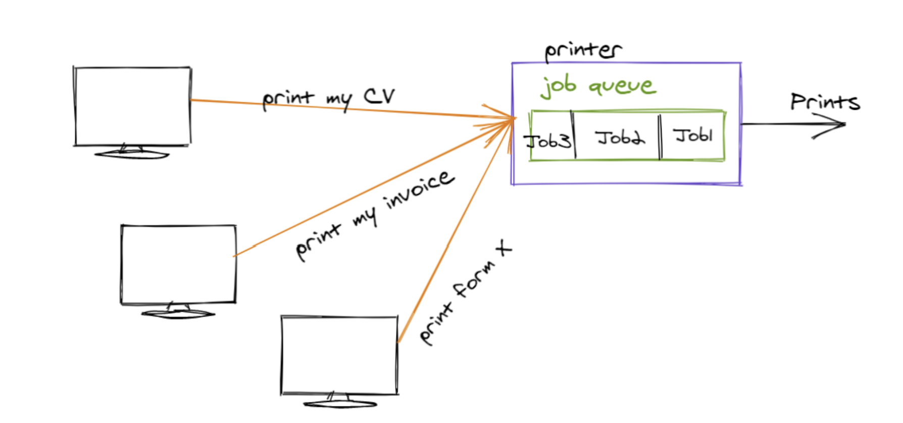

# Queue Tutorial Attributions

## Class Materials:

[Lesson 01: Dynamic Arrays](https://byui-cse.github.io/cse212-course/lesson01/01-prepare.html)

[Lesson 02: O Notation](https://byui-cse.github.io/cse212-course/lesson02/02-prepare.html)

[Lesson 04: Queues](https://byui-cse.github.io/cse212-course/lesson04/04-prepare.html#1.4)

[Lesson 07: Linked Lists](https://byui-cse.github.io/cse212-course/lesson07/07-prepare.html)

&nbsp;

## Online Articles:

[Dynamic Array Queue](https://web.engr.oregonstate.edu/~sinisa/courses/OSU/CS261/lectures/Deque.pdf)

[Selecting the Best Queue Data Structure for Your Use Case](https://www.cardinalpeak.com/blog/selecting-the-best-queue-data-structure-for-your-use-case)

[Linked Lists in Python: An Introduction](https://realpython.com/linked-lists-python/)

&nbsp;

## Images:

[Image by pch.vector](https://www.freepik.com/free-vector/sale-illustration-line-customers-waiting-store-opening_13146640.htm#query=people%20waiting&position=1&from_view=keyword&track=ais) on Freepik

(Note: The image's captions are not part of the original image.)

[Printer Queue](https://algodaily.com/lessons/understanding-the-queue-data-structure-and-its-implementations)

&nbsp;

## Library Waitlist Example Titles:

All book titles used in this example are real programming-related books that can be found in the following article: ["70 Best Programming Books for Every Coder in 2022"](https://learntocodewith.me/posts/programming-books/).
